# High Availability

이번 장에서는 고가용성을 위해 어떤 AWS 서비스들을 사용할 수 있는지 알아봅니다.

High Availability란 한국말로 고가용성으로 장애에도 서비스가 중단되지 않고 availability를 유지하는 것을 의미합니다.
한마디로 항상 접속이 되는 상태를 유지하는 것을 말합니다.

고가용성을 유지하기 위한 가장 기본적인 방법으로 동일한 서버를 두개 이상으로 늘리고 앞단에 Load Balancer를 두는 방법이 있습니다.

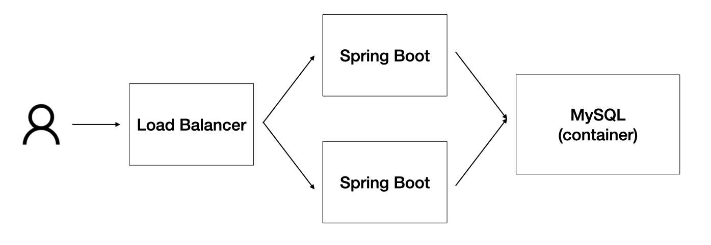

이를 위해서 서버 구성을 자동화하고 ELB(Elastic Load Balancer)를 사용하는 방법을 알아봅시다.


## 사용해 볼 AWS 서비스

- EC2 user data: 서버 시작시 자동으로 실행되는 init 스크립트
- AMI (Amazon Machine Image): OS 이미지 굽기 (iso 파일 같은 것)
- ELB (Elastic Load Balancer): Proxy 서버, LB
	- Target Group: upstream 서버 리스트 <details><summary>Image</summary></details>
- ASG (Auto Scaling Group): 자동으로 서버의 대수를 확장해주는 서비스
	- Launch Template: 사전에 정의된 서버 template <details><summary>Image</summary></details>

## 서버 구성 자동화

### user data 사용

user data를 이용하여 새롭게 ec2를 생성해 봅시다.

이번에 이름은 `myec2-ha`라고 지정한다. 나머지 값은 기존과 전부 동일하게 하되, 두가지 변경 사항이 있습니다.


#### Network settings

`Network settings`에서 `Firewall`에서 새롭운 security group을 만드는 것이 아니라 이전에 만들었던 security group으로 생성합니다.

- `launch-wizard-xxx`: 기존에 만들었던 EC2 security group
- `ec2-rds-1-xxx`: RDS 접근을 위해 자동으로 생성된 security group


#### User data

맨 아래에 `Advanced details`을 클릭하여, 다시 맨 아래에 내려가면 `User data`라고 보이는 text field가 보인다. 그곳에 아래와 같이 입력해 줍니다.

```bash
#!/bin/bash
export AWS_ACCESS_KEY_ID=xxxx
export AWS_SECRET_ACCESS_KEY=xxxx
export AWS_DEFAULT_REGION=ap-northeast-2

sudo apt update && sudo apt install -y amazon-ecr-credential-helper docker.io awscli
sudo usermod -aG docker ubuntu
$(sudo -E aws ecr get-login --no-include-email)
sudo docker run -d -p 80:8080 --restart always xxxx.dkr.ecr.ap-northeast-2.amazonaws.com/yctech-aws
```

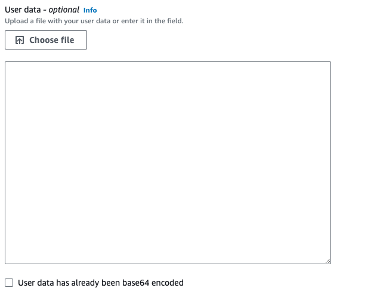

### AMI 생성하기

매번 이렇게 user data에 넣는 것 보다는 한번 이미지를 생성하여 해당 이미지를 재활용하는 방법이 더 편합니다.

EC2 dashboard로 돌아와서, `myec2-ha` instance 체크 > `Actions` > `Image and templates` > `Create Image` 클릭

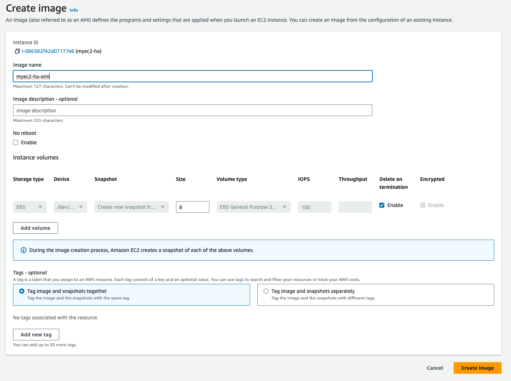

Image name: `myec2-ha-ami` > `Create Image`

생성한 이미지는 왼쪽 패널의 `AMIs`를 클릭하면 볼 수 있다. 생성하는데 시간이 조금 걸립니다. `Status`가 `Pending`이 아닌 `Available`로 나오면 완료.

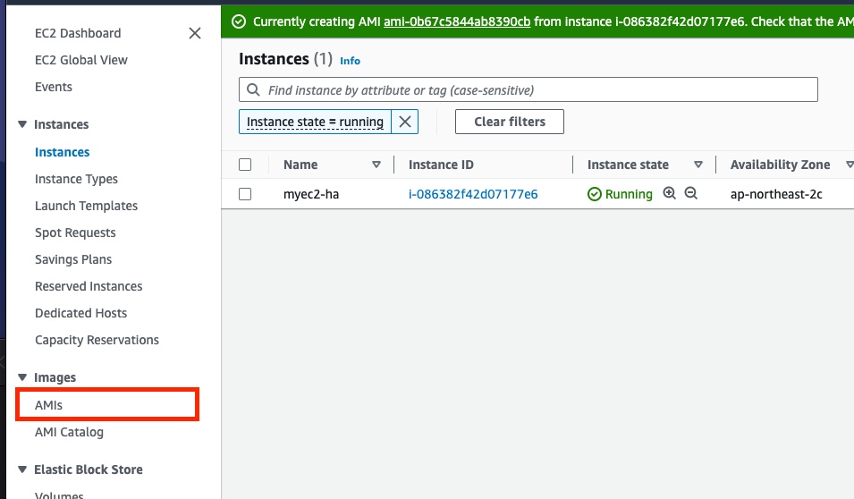

### 생성한 AMI로 EC2 생성하기


`myec2-ha-ami` 선택 > `Launch instance from AMI`

이름을 `myec2-from-ami` 입력, 네트워크 설정만 수정하고 바로 생성 --> 해당 EC2로 접속해 보면 기존과 동일한 설정이 이미 되어 있는 것을 확인할 수 있습니다.

## ELB 설정

### Target Group 생성하기

왼쪽 패널에 `Target Groups` 클릭
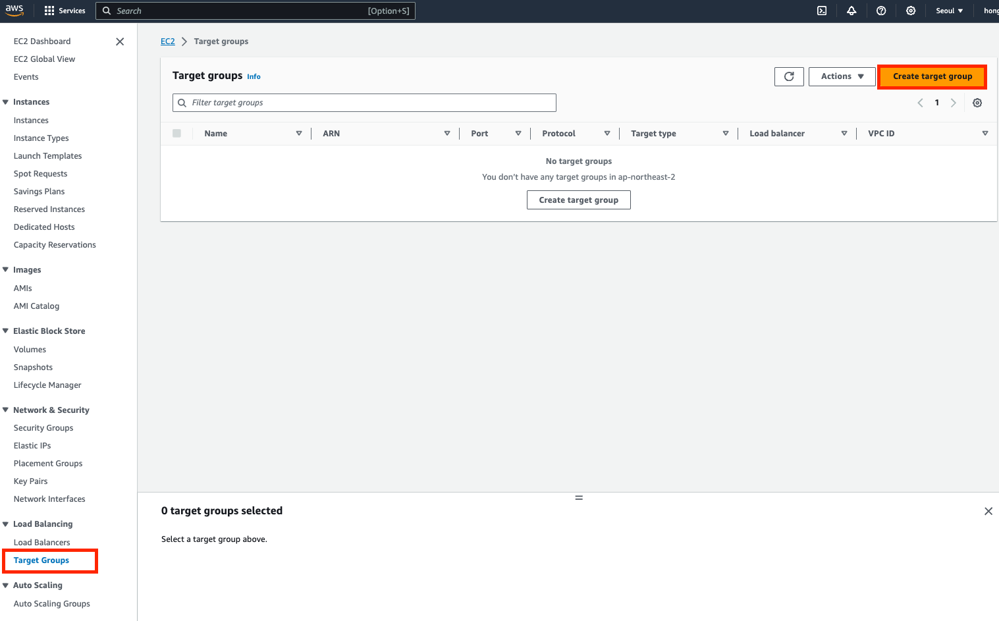

- Choose target type: `instances`
- Target group name: mytarget-group
	
	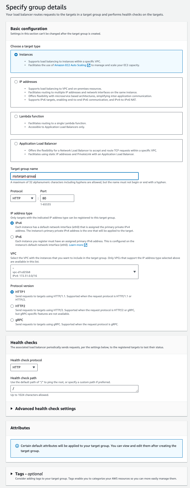
- Register targets: 전체 선택 > `Include as pending below`
	
	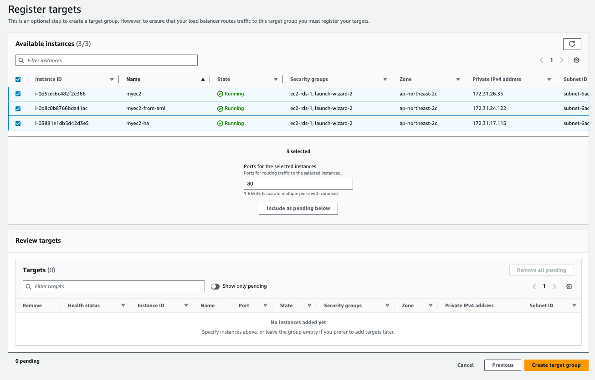
- `Create target group`

### ELB 생성하기

이제 왼쪽 패널에서 Load Balancers 클릭

- Application Load Balancer
	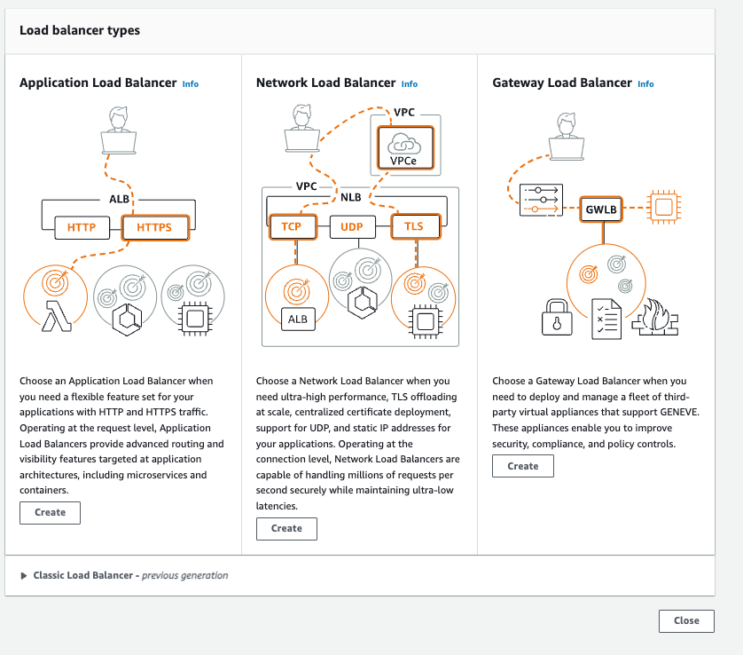
- Load balancer name: `myelb`
- Network mapping: 4개 전부 선택 (ap-northeast-2a, b, c, d)
- Security groups: `launch-wizard-xxx`
- Listener: Default action - Forward to `mytarget-group`
- Create load balancer
	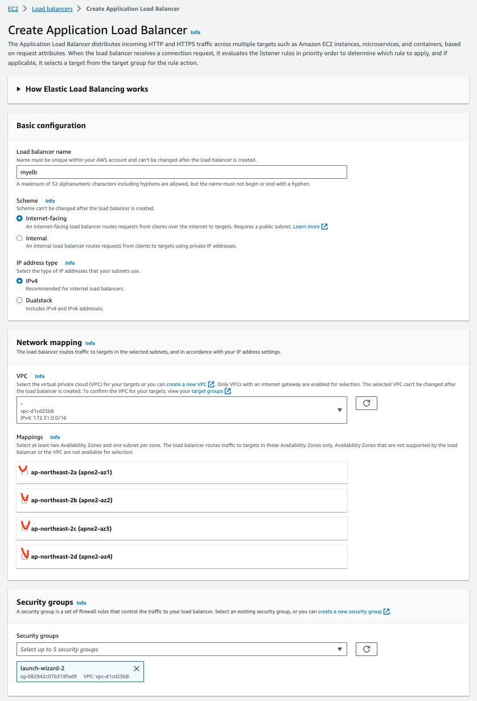
	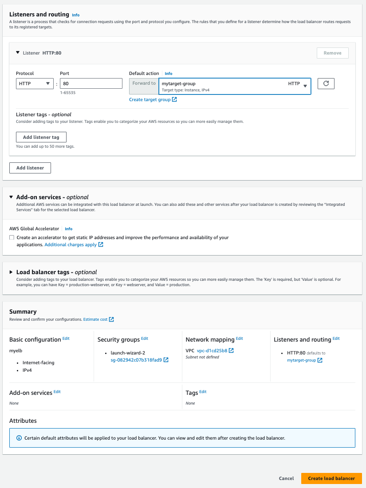

### Auto Scaling Group (ASG)

#### Launch Template 생성하기

왼쪽에서 `Launch Templates` 클릭

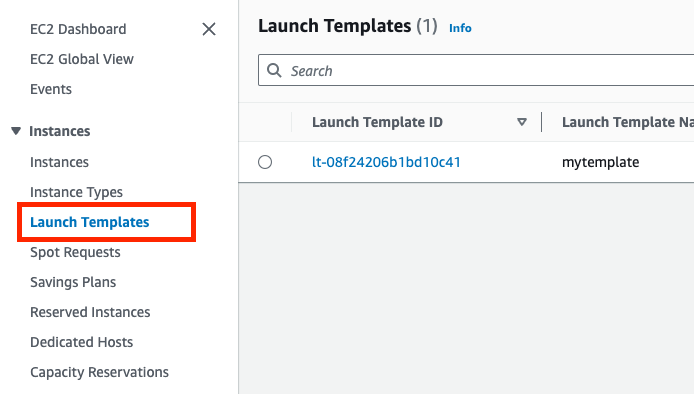

- Launch template name: `mytemplate`
- Application and OS Images: `My AMIs` > `myec2-ha-ami`
- Instance type: `t2.micro`
- Key pair: `mykeypair`
- Network settings: Firewall > `Select existing security group` > `ec2-rds1`, `launch-wizard-xxx`
- Create template


#### ASG 생성하기

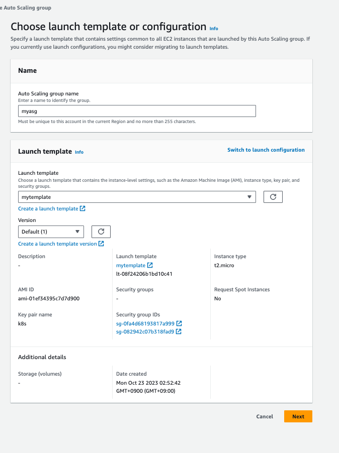
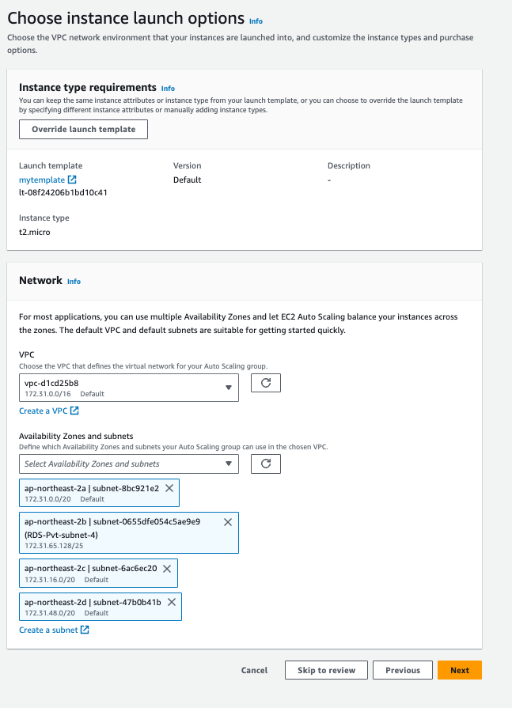
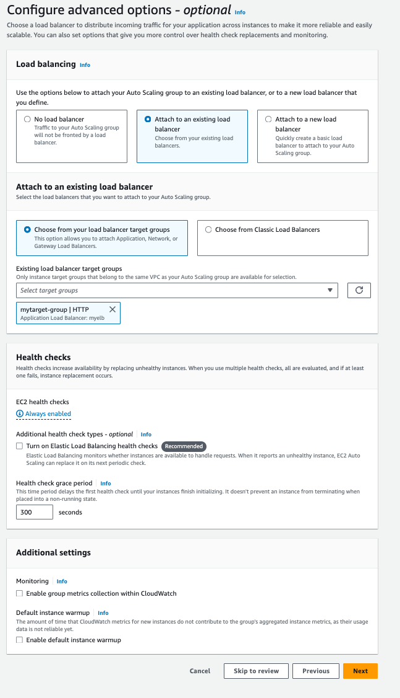
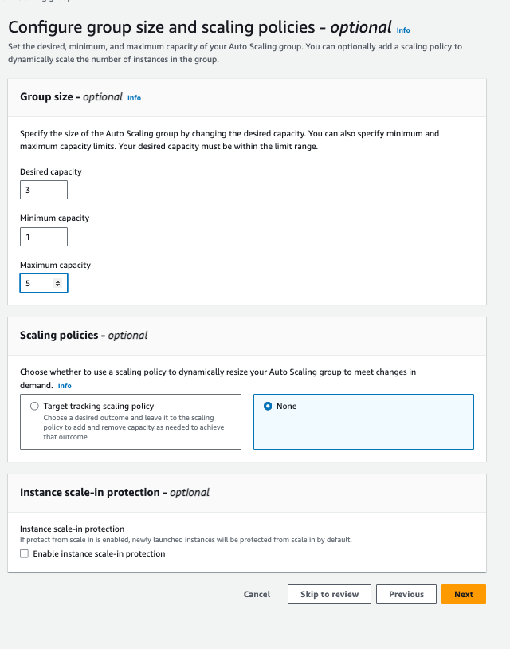


## 실습 (Optional)

Spring Boot 어플리케이션에서 URL을 클릭하면 실제 사진으로 이동할 수 있게 만들어 봅시다.

1. Spring Boot 어플리케이션 코드 수정
2. 이미지 빌드 및 배포
3. 신규 EC2 생성 시, User data에 등록
4. 해당 EC2에 대해서 AMI 생성
5. Launch Template 신규 생성
6. ASG 신규 생성

## 읽을 거리

- [Auto Scaling 개념 원리 & 사용 세팅 정리](https://inpa.tistory.com/entry/AWS-%F0%9F%93%9A-EC2-%EC%98%A4%ED%86%A0-%EC%8A%A4%EC%BC%80%EC%9D%BC%EB%A7%81-ELB-%EB%A1%9C%EB%93%9C-%EB%B0%B8%EB%9F%B0%EC%84%9C-%EA%B0%9C%EB%85%90-%EA%B5%AC%EC%B6%95-%EC%84%B8%ED%8C%85-%F0%9F%92%AF-%EC%A0%95%EB%A6%AC)